# Travesía, reserva de cruceros

Aplicación web para una naviera ficticia: catálogo de cruceros, barcos y camarotes, reserva
en línea con pago, facturas en PDF para el cliente y un panel de administración.

Proyecto del curso ISW-613 Programación Web (UTN).

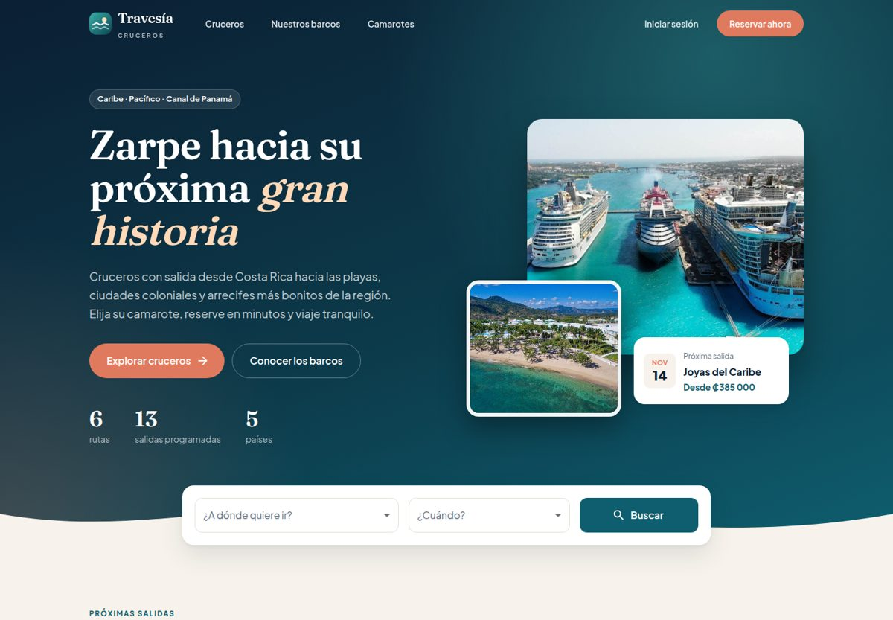

## Cuentas de prueba

| Rol | Correo | Contraseña |
|-----|--------|------------|
| Administrador | `admin@travesia.test` | `Admin2026!` |
| Cliente | `cliente@travesia.test` | `Cliente2026!` |

## Tecnologías

- **Frontend:** React 18, Vite, Material UI, React Router, React Hook Form con Yup, Axios y React-PDF.
- **Backend:** API REST en PHP 8 con patrón MVC, Composer y JWT (firebase/php-jwt).
- **Base de datos:** MySQL o MariaDB, con 17 tablas, triggers y un procedimiento almacenado.

## Funcionalidades

**Sitio público**
- Buscador por destino y mes, rutas destacadas y próximas salidas.
- Catálogo con filtros por destino, mes, duración y precio.
- Detalle del crucero con itinerario, fechas de salida y precio por tipo de camarote.
- Flota de barcos y tipos de camarote.

**Clientes**
- Registro e inicio de sesión con JWT; contraseñas con `password_hash`.
- Reserva en 5 pasos: salida, camarotes, huéspedes, complementos y pago. Muestra subtotal,
  IVA (13 %) y total, y valida la tarjeta con el algoritmo de Luhn.
- Mis reservas, con el estado del pago y la factura en PDF.

**Administración**
- Indicadores: reservas, pasajeros, monto cobrado y pendiente, ingresos por crucero.
- Listados con búsqueda de reservas, cruceros, barcos, camarotes y usuarios.
- Crear y editar cruceros (itinerario, salidas, tarifas e imagen), barcos, camarotes y complementos.

**Backend**
- Permisos por ruta: el catálogo es público, las reservas requieren sesión y cada cliente
  solo ve las suyas, y las operaciones de escritura son solo para administradores.
- Sentencias preparadas en las consultas con datos del usuario.
- La reserva se guarda en una transacción. Los triggers y el procedimiento
  `recalcular_precio_reserva` mantienen el precio final y la disponibilidad de camarotes.

## Estructura

```
├── backend/          API en PHP
│   ├── controllers/  Controladores y clases base (conexión, request, response, logger)
│   ├── models/       Acceso a datos
│   ├── routes/       Enrutador y permisos
│   ├── middleware/   Autenticación JWT
│   └── uploads/      Imágenes de los cruceros
├── frontend/         Aplicación React
│   └── src/          pages, components, context, services, themes, utils
├── bd.sql            Estructura, datos de ejemplo, triggers y procedimiento
└── router.php        Router para el servidor embebido de PHP
```

## Ejecutar en local

Requisitos: PHP 8 con `mysqli`, MySQL o MariaDB, Composer y Node.js 18 o superior.

1. **Base de datos:** importar `bd.sql` (crea la base `prueba1` con datos de ejemplo).
   ```bash
   mysql -u root -p < bd.sql
   ```
2. **API:**
   ```bash
   cd backend
   composer install
   cp config.example.php config.php   # usuario y contraseña de MySQL
   cd ..
   php -S localhost:8000 router.php   # API en http://localhost:8000/api/
   ```
   También funciona con XAMPP copiando `backend` a `htdocs/crucero`.
3. **Frontend:**
   ```bash
   cd frontend
   cp .env.example .env
   npm install
   npm run dev                        # http://localhost:5173
   ```

## Endpoints principales

| Método | Ruta | Acceso | Descripción |
|--------|------|--------|-------------|
| POST | `usuarioC/login` | Público | Inicia sesión y devuelve el JWT |
| POST | `usuarioC/registrar` | Público | Crea una cuenta de cliente |
| GET | `usuarioC/perfil` | Sesión | Datos del usuario |
| GET | `Crucero/catalogo` | Público | Cruceros con próxima salida y precio desde |
| GET | `Crucero/detalle/{id}` | Público | Itinerario, salidas y tarifas |
| GET | `barco/catalogo`, `barco/detalle/{id}` | Público | Flota y camarotes |
| GET | `Reserva/index` | Sesión | Reservas del usuario (todas si es administrador) |
| GET | `Reserva/{id}` | Sesión | Detalle de la reserva |
| POST | `Reserva` | Sesión | Crea una reserva |
| POST | `InfoPagoC` | Sesión | Paga una reserva pendiente |
| GET | `ReporteC/resumen` | Admin | Indicadores del panel |
| POST, PUT | `Crucero`, `barco`, `habitacion`, `ComplementoC` | Admin | Crear y actualizar |
| POST | `image` | Admin | Subir la imagen de un crucero |

## Capturas

| Catálogo | Detalle de crucero |
|---|---|
| 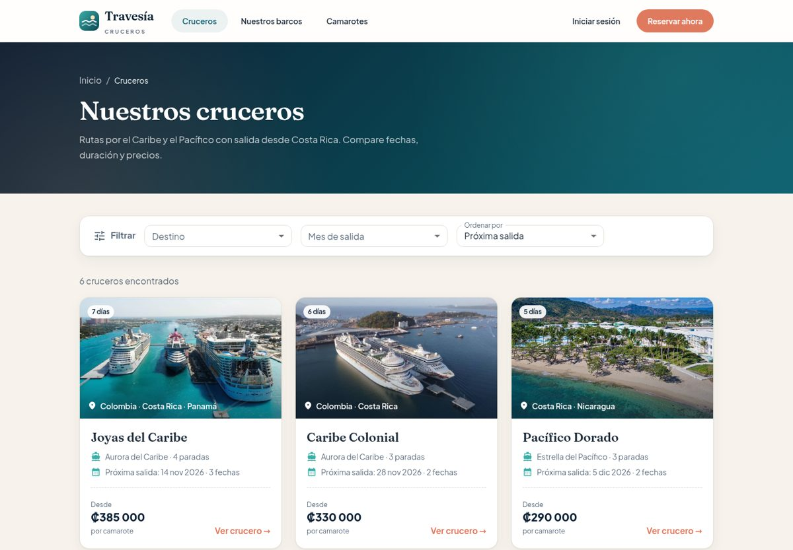 | 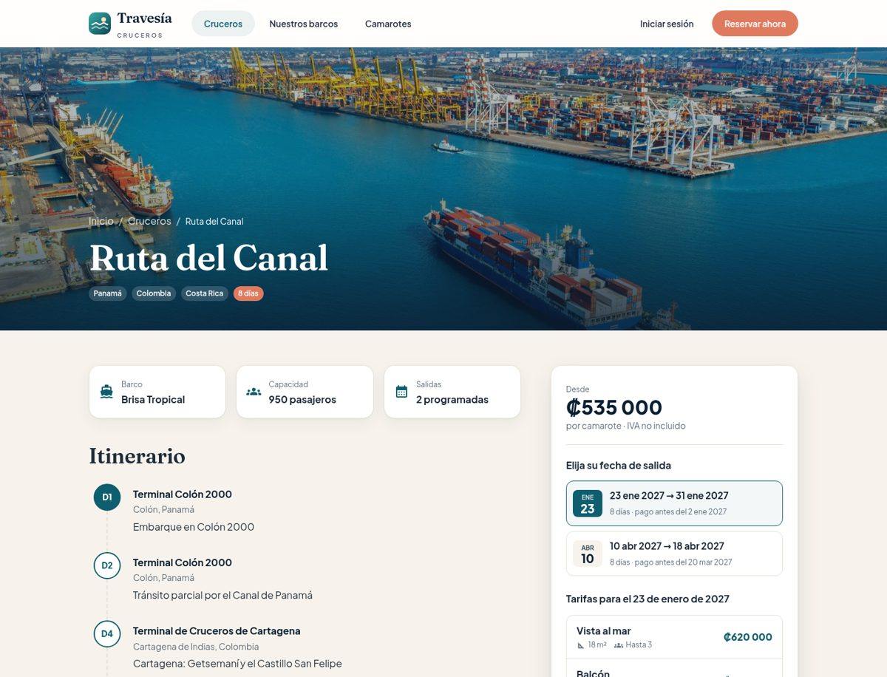 |

| Reserva: camarotes | Reserva: pago |
|---|---|
| 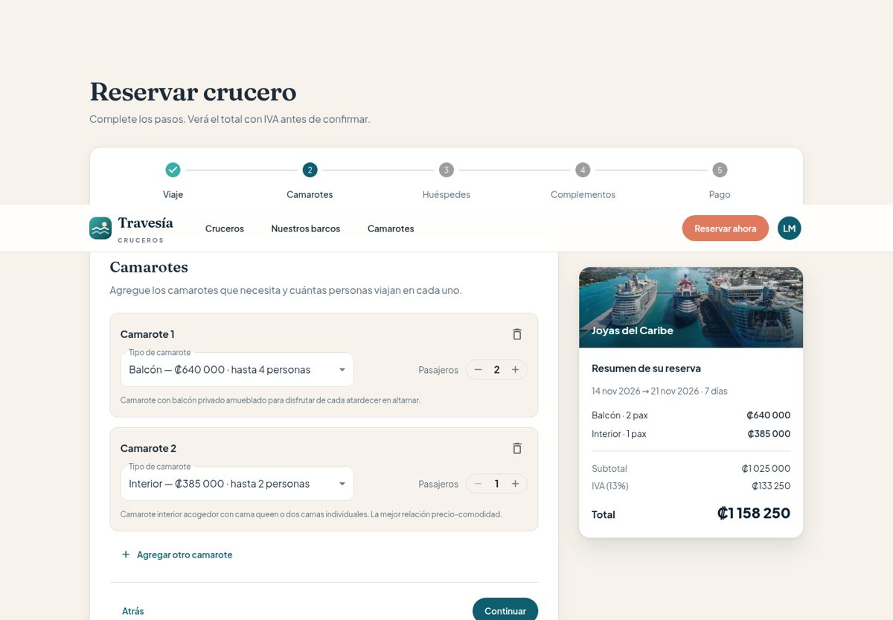 | 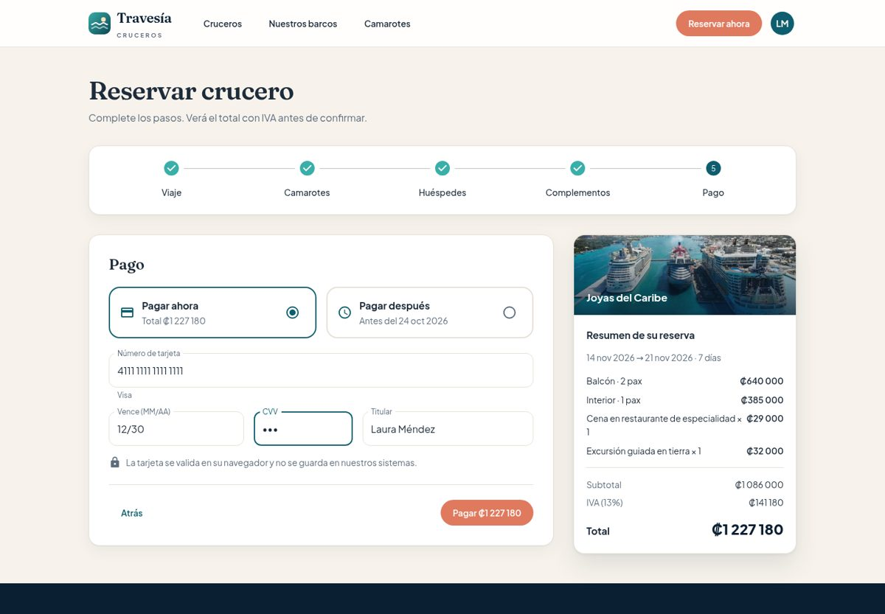 |

| Detalle de reserva | Factura PDF |
|---|---|
| 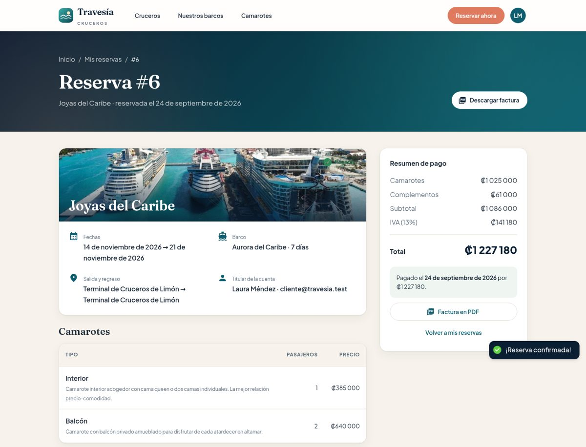 | 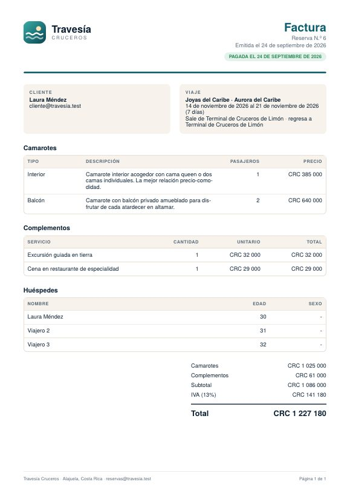 |

| Panel de administración | Reservas |
|---|---|
| 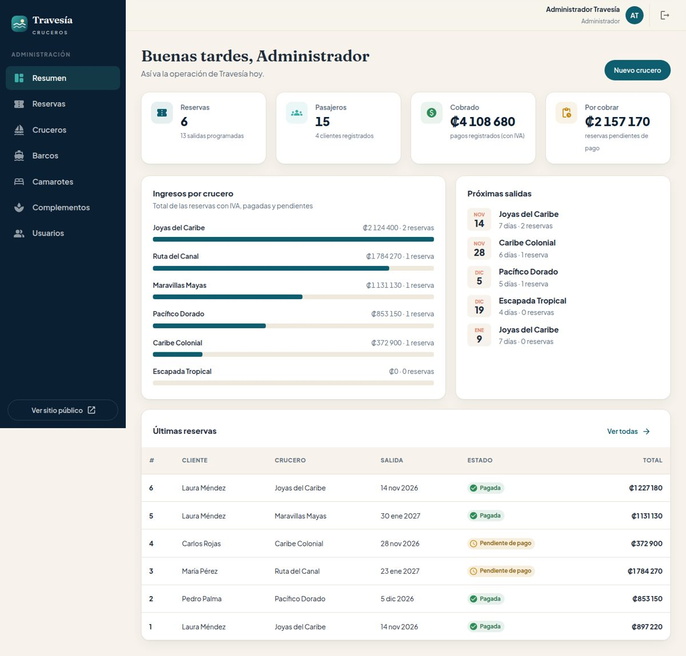 | 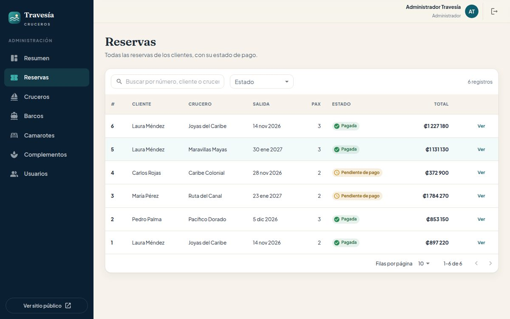 |

| Inicio de sesión | Teléfono |
|---|---|
| 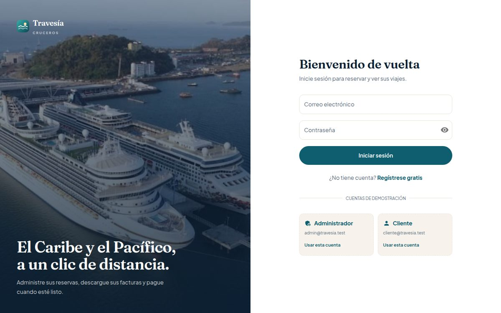 | 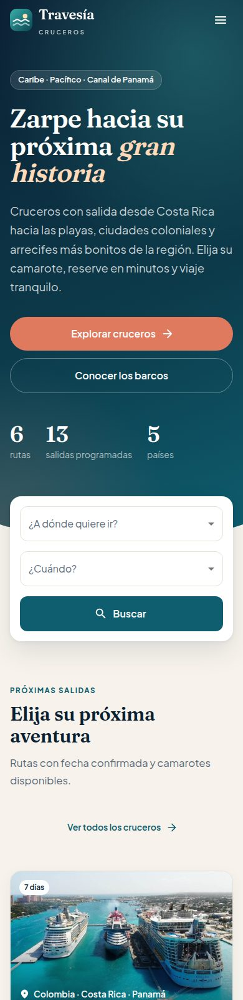 |

## Pendiente

- Pruebas automáticas del API y del frontend.
- Pasarela de pago real (el pago actual es simulado).
- Recuperación de contraseña por correo.

## Autor

Henderry Moscat Benedict
